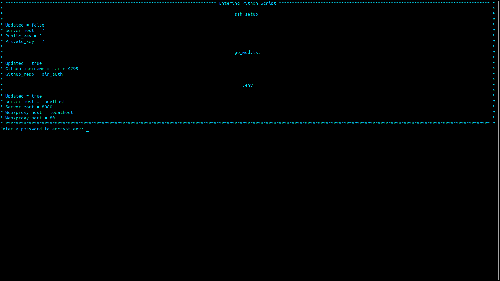

# Authentication for Golang's Gin Framework

This project provides a basic web authentication system for the Gin framework in Golang. 

If you choose to use this for your server. Change the names of variables, they were made to be readable.

I would also recommend [Hashicorp Vault](https://www.vaultproject.io/) instead of using env vars.

Restrictions: Usernames must be unique

## Prerequisites

- It's recommended to have Go and Python installed. If not, the setup script will handle the installations.

## Setup

1. Clone the repository:
   ```bash
   git clone https://github.com/carter4299/gin_auth.git
   cd gin_auth
   ```

2. Make the setup script executable and run it:
   ```bash
   chmod +x load.sh
   ./load.sh
   ```

   

3. During the setup, you'll be prompted for several configurations:

   - **SSH Server Setup**: Decide if you'd like to set up an SSH server.
     - Default user: `current_user = os.getlogin()`
     - Default server address: `server_address = subprocess.getoutput("hostname -I").split()[0]`

   - **Go Module Initialization**: Provide a GitHub username and repository name for initializing the go module.
     ```bash
     go mod init github.com/{username}/{repo_name}
     ```

   - **Server Configuration**: Set the following environment variables:
     - `SERVER_HOST`
     - `SERVER_PORT`
     - `WEB_PROXY_HOST`
     - `WEB_PROXY_PORT`

   - **Encryption Keys Generation**: Use the following links to generate encryption keys:
     - [AES-256-CBC Key Generator](https://generate-random.org/encryption-key-generator?count=7&bytes=16&cipher=aes-256-cbc&string=&password=)
     - [AES-256-CBC-HMAC-SHA256 Key Generator](https://generate-random.org/encryption-key-generator?count=2&bytes=32&cipher=aes-256-cbc-hmac-sha256&string=&password=)

4. After the Python script execution, the bash script will take over and prompt you to:

   - Set a password to encrypt environment variables:
     ```bash
     read -s -p "Enter a password to encrypt env: " encryption_password
     echo -n "$data" | openssl enc -aes-256-cbc -salt -out "$ENCRYPTED_FILE" -k "$password" -pbkdf2
     ```

   - Decide if you'd like to use CompileDaemon for automatic code compilation and execution:
     ```bash
     CompileDaemon -command="./$github_repo"
     ```

# Database Schema

## Initial User Table

```go
type initial_user_table struct {
    hashed_username     []byte
    to_user_password_indexs_table_x  []byte
    to_user_password_indexs_table_y int
}
```

```sql
CREATE TABLE initial_user_table (
    hashed_username BLOB PRIMARY KEY NOT NULL,
    to_user_password_indexs_table_x BLOB NOT NULL,
    to_user_password_indexs_table_y INTEGER NOT NULL
);

INSERT INTO initial_user_table(hashed_username, to_user_password_indexs_table_x, to_user_password_indexs_table_y) 
VALUES(?, ?, ?);
```

---

## User Password Indexs Table

```go
type user_password_indexs_table struct {
    i_d_X []byte
    to_passwords_table_x        []byte
    to_passwords_table_y        int
    to_usernames_table_x        []byte
    to_usernames_table_y        int
}
```

```sql
CREATE TABLE user_password_indexs_table (
    i_d_X BLOB PRIMARY KEY NOT NULL,
    to_passwords_table_x BLOB NOT NULL, 
    to_passwords_table_y INTEGER NOT NULL,
    to_usernames_table_x BLOB NOT NULL, 
    to_usernames_table_y INTEGER NOT NULL
);

INSERT INTO user_password_indexs_table(i_d_X, to_passwords_table_x, to_passwords_table_y, to_usernames_table_x, to_usernames_table_y) 
VALUES(?, ?, ?, ?, ?);
```

---

## Passwords Table

```go
type passwords_table struct {
    i_D_x      []byte
    password []byte
}
```

```sql
CREATE TABLE passwords_table (
    i_D_x BLOB PRIMARY KEY NOT NULL,
    password BLOB NOT NULL
);

INSERT INTO passwords_table(i_D_x, password) 
VALUES(?, ?);
```

---

## Usernames Table

```go
type usernames_table struct {
    I_d_x     []byte
    username []byte
}
```

```sql
CREATE TABLE usernames_table (
    I_d_x BLOB PRIMARY KEY NOT NULL,
    username BLOB NOT NULL
);

INSERT INTO usernames_table(I_d_x, username) 
VALUES(?, ?);
```

---

## All Auth Tokens

```go
type all_auth_tokens struct {
    i_D_X        []byte
    to_usernames    []byte
    to_usernames_key     int
}
```

```sql
CREATE TABLE all_auth_tokens (
    i_D_X BLOB PRIMARY KEY NOT NULL,
    to_usernames BLOB NOT NULL,
    to_usernames_key INTEGER NOT NULL
);

INSERT INTO all_auth_tokens(i_D_X, to_usernames, to_usernames_key) 
VALUES(?, ?, ?);
```

---

## Active Auth Tokens

```go
type active_auth_tokens struct {
    private_auth_token []byte
    to_all_auth_tokens  []byte
    to_all_auth_tokens_key  int
    start_time int32
    close_time int32
}
```

```sql
CREATE TABLE active_auth_tokens (
    private_auth_token BLOB PRIMARY KEY NOT NULL,
    to_all_auth_tokens BLOB NOT NULL,
    to_all_auth_tokens_key INTEGER NOT NULL,
    start_time TIMESTAMP DEFAULT CURRENT_TIMESTAMP, 
    close_time TIMESTAMP DEFAULT (datetime(CURRENT_TIMESTAMP, '+1 hour'))
);

INSERT INTO active_auth_tokens(private_auth_token, to_all_auth_tokens, to_all_auth_tokens_key, start_time, close_time) 
VALUES(?, ?, ?, ?, ?);
```

# Front-End

## Source Code

```bash
   cd test_api_source
   #To install node_modules
   npm install
   #To Host w/ Vite (default localhost:5173)
   npm run dev
   #To build static
   npm run build
```


- [Test Api](./test_api_source/src/hooks/auth_api.tsx) and [Test Functions](./test_api_source/src/hooks/auth_util.tsx.tsx) have typescript example code to format correctly to pass Cors Middleware

### Variables

1. Username:
```tsx
   export const base64Encode = (str: string) => {
    return btoa(encodeURIComponent(str).replace(/%([0-9A-F]{2})/g, (match, p1) => {
        return String.fromCharCode(Number('0x' + p1));
    }));
    }
   formData.append("user_id", encodedUserName);
```

2. Password:
```tsx
    export const base64EncodeToBytes = (str: string) => {
        const encoded = btoa(encodeURIComponent(str).replace(/%([0-9A-F]{2})/g, (match, p1) => {
            return String.fromCharCode(Number('0x' + p1));
        }));
        const charList = encoded.split('');
        const uintArray = [];
        for (let i = 0; i < charList.length; i++) {
            uintArray.push(charList[i].charCodeAt(0));
        }
        return new Uint8Array(uintArray);
    }
    formData.append("password", new Blob([encodedUserPass]));
```
